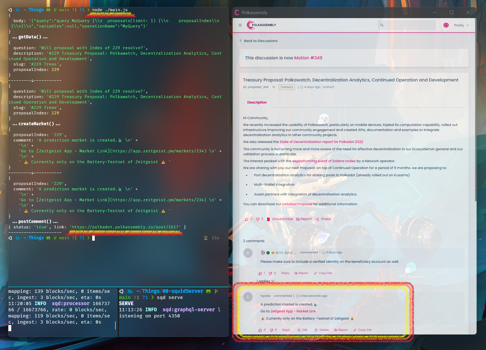

<a name="readme-top"></a>

<br />
<div align="center">
  <a href="https://github.com/polkahack/futarchy">
    
  </a>

<h3 align="center">Futurachy - Quickstart</h3>
  <p align="center">
    <a href="https://github.com/polkahack/futarchy">Futurachy</a> creates incentives for goverments. </a>
    <br />
    Quickstart is a simplified version of Futurachy.
    <br />
    <br />
    <a href="https://youtu.be/ue22iS_N0MU" name="demo">View Demo</a>
    ·
    <a href="https://github.com/PolkaHack/futarchy/issues">Report Bug</a>
    ·
    <a href="https://github.com/polkahack/futarchy/issues">Request Feature</a>
  </p>
</div>

<details>
  <summary>Table of Contents</summary>
  <ol>
    <li>
      <a href="#about-the-project">About The Project</a>
      <ul>
        <li><a href="#Screenshot">Screenshot</a></li>
        <li><a href="#Description">Description</a></li>
        <li><a href="#TLDR">TLDR</a></li>
        <li><a href="#built-with">Built With</a></li>
      </ul>
    </li>
    <li>
      <a href="#getting-started">Getting Started</a>
      <ul>
        <li><a href="#installation">Installation</a></li>
      </ul>
    </li>
    <li><a href="#usage">Usage</a></li>
    <li><a href="#contact">Contact</a></li>
    <li><a href="#acknowledgments">Acknowledgments</a></li>
  </ol>
</details>

## About The Project

### Screenshot


### Description
This is a Quickstart of the Project [Futurachy](https://github.com/PolkaHack/futarchy).

Futurachy creates incentives to for governments.

Quickstart is a simplified version of the inner workings.

#### Summary
1. It spins up a Indexer, which graps the latest proposal from the Zeitgeist Chain. 
2. It creates a graphQL endpoint. 
3. It gets the Data through the GraphQL Endpoint. 
4. It fetches the title from polkassembly based on the graphQL data.
5. It converts the title in question, description and slug. 
6. It creates a market from question, description and slug.
7. The created Market created a market Id.
8. It converts converts marketId to a marketLink.
8. It posts a comment in [polkassembly](https://polkadot.polkassembly.io/) with a link to the newly created Market.

<p align="right">(<a href="#readme-top">back to top</a>)</p>

### Built With

 [![NodeJs][nodejs]][nodejs-url]
 [![Subsquid][subsquid]][subsquid-url]
 [![Zeitgeist][zeitgeist]][zeitgeist-url]

<p align="right">(<a href="#readme-top">back to top</a>)</p>

## Getting Started

Follow [README](https://github.com/PolkaHack/Things/blob/main/README.md) or Follow via [Video](https://youtu.be/ue22iS_N0MU). 

### Installation

1. check if `node` is installed. If not download it from [NodeJs.org][nodejs-url].
```sh
> node --version
>> v18.13.0
```
2. change directory to `./00-squidServer`
```sh
cd ./00-squidServer
```
3. rename `./env-example` to `./env`
```sh
mv ./env-example ./env
```
4. source your `./env`
```sh
source ./env
```
5. install packages, create `./node_modules` folder
```sh
npm install 
```
6. set up subsquid indexer. 
```sh
sqd up
sqd codegen
sqd migration:generate
```
7. run the mirgation process
```sh
sqd process
```
8. Amazing, open up a fresh new Terminal and let the indexer run.
9. In the new terminal navigate to the `./00-squidServer` 
10. start the graphQL server
```sh
sqd serve
```
11. Got to [http://localhost:4350/graphql](http://localhost:4350/graphql)
12. select or paste this query and run it.
```graphql
query MyQuery {
  proposals(limit: 1)
}
```
This is my current output, you will slidly diffrent. Because new proposal will come in daily.
```js
{
  "data": {
    "proposals": [
      {
        "id": "0015438492-000039-c308a"
      }
    ]
  }
}
```
13. Now we have our indexer and graphQL Server running.
14. Open up a 3rd Terminal and navigate to the root folder.
15. run tree and you should see the following
```sh
tree -L 1
``` 
```
.
├── 00-squidServer
├── 01-getData
├── 02-createMarket
├── 03-postComment
├── README-depracted.md
├── README.md
├── logs
├── main.js
├── node_modules
├── package-lock.json
├── package.json
├── screenshot.png
└── subsquare.js

6 directories, 7 files
```
16. Install packages
```sh
npm install
```
17. rename `./env-example` to `./env`
```sh
mv ./env-example ./env
```
18. paste seed in your Dev Account with Zeitgeist Token of the Battery Testnet into the `.env`
```sh
echo "seed=YOUR_SEED_WITH_ZTG_TOKENS_ON_BATERRY_TEST_NEXT" >> .env
```
19. source your `./env`
```sh
source ./env
```
20. run the main script.
```sh 
node ./main.js
```
21. You see the following outcome.


<p align="right">(<a href="#readme-top">back to top</a>)</p>

## Usage

Use this space to show useful examples of how a project can be used. Additional screenshots, code examples and demos work well in this space. You may also link to more resources.

<p align="right">(<a href="#readme-top">back to top</a>)</p>

## Contact

Frank Bevr - frank_dierolf@web.de - [Discord: FrankBevr#9593]()
K Gunjan - gunjan.cn@gmail.com - [LinkedIn](https://in.linkedin.com/in/gunjan321)
Morkeltry -
Serge -

Project Link: [Futurachy](https://github.com/polkahack/futarchy)

<p align="right">(<a href="#readme-top">back to top</a>)</p>

## Acknowledgments

- [Massimo Luraschi](https://github.com/RaekwonIII) :heart:
- [Yornaath](https://github.com/yornaath) :heart:

<p align="right">(<a href="#readme-top">back to top</a>)</p>

<!-- MARKDOWN LINKS & IMAGES -->

[product-screenshot]: images/screenshot.png
[nodejs]: https://img.shields.io/badge/Node.js-43853D?style=for-the-badge&logo=node.js&logoColor=white
[nodejs-url]: https://nodejs.org
[zeitgeist]: https://img.shields.io/badge/Zeitgeist-Parachain-black?style=for-the-badge&logo=polkadot
[zeitgeist-url]: https://zeitgeist.pm/
[subsquid]: https://img.shields.io/badge/Subsquid-ChainIndexer-black?style=for-the-badge&logo=OctopusDeploy
[subsquid-url]: https://www.subsquid.io/
